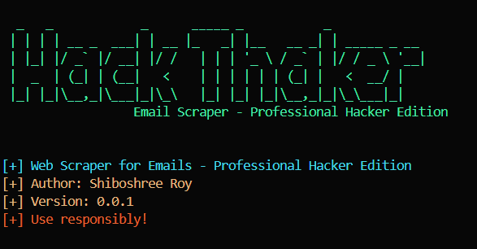

# Email Scraper

 

A professional and advanced web scraping tool to extract email addresses from a target website and its linked pages. Built with Python, this tool is designed for ethical hacking, penetration testing, and data collection purposes.

---

## Features

- **Email Extraction**: Scrapes email addresses from web pages using regex.
- **Recursive Scraping**: Follows links on the target website to scrape emails from multiple pages.
- **Hacker-Themed CLI**: A cool, professional hacker-themed command-line interface with colored output.
- **Customizable**: Set a maximum number of URLs to scrape and specify an output file.
- **Error Handling**: Robust error handling for network issues, invalid URLs, and timeouts.
- **Logging**: Detailed logging for tracking progress and debugging.

---

## Installation

1. **Clone the repository**:
   ```bash
   git clone https://github.com/shiboshreeroy/email-scraper.git
   cd email-scraper
   ```

2. **Install dependencies**:
   ```bash
   pip install -r requirements.txt
   ```

3. **Run the script**:
   ```bash
   python email_scraper.py https://example.com -m 50 -o output_emails.txt
   ```

---

## Usage

### Command-Line Arguments

| Argument       | Description                                      | Default Value |
|----------------|--------------------------------------------------|---------------|
| `url`          | The target URL to start scraping from.           | Required      |
| `-m, --max-urls` | Maximum number of URLs to process.              | 100           |
| `-o, --output`  | Output file to save the scraped emails.          | `emails.txt`  |

### Example

```bash
python email_scraper.py https://example.com -m 50 -o output_emails.txt
```

This command will:
- Start scraping from `https://example.com`.
- Process a maximum of 50 URLs.
- Save the scraped emails to `output_emails.txt`.

---

## Screenshots

 <!-- Replace with an actual screenshot if you have one -->

---

## License

This project is licensed under the MIT License. See the [LICENSE](LICENSE) file for details.

---

## Disclaimer

This tool is intended for **ethical and legal use only**. Do not use it for unauthorized scraping or any malicious purposes. The developer is not responsible for any misuse of this tool.

---

## Contributing

Contributions are welcome! Please open an issue or submit a pull request for any improvements or bug fixes.

---

## Author

[Shiboshree Roy](https://github.com/shiboshreeroy)
